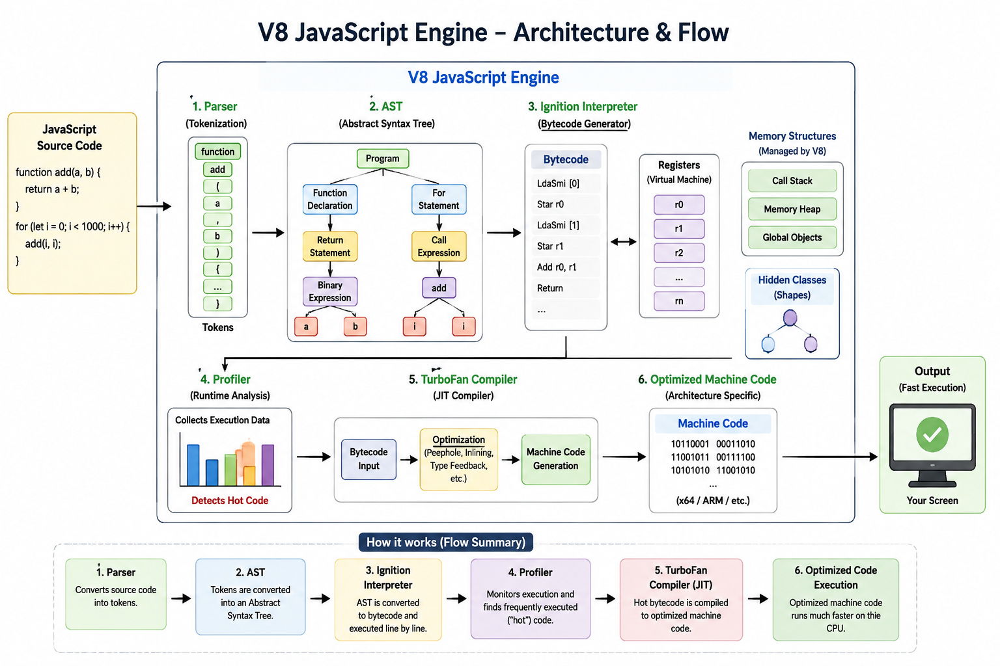

### JS Engine

জাভাস্ক্রিপ্ট কোড সরাসরি কম্পিউটার বুঝতে পারে না। তাই ব্রাউজারের ভিতরে থাকা JavaScript Engine আমাদের কোডকে ধাপে ধাপে process করে machine-readable form এ রূপান্তর করে। কয়েকটি জনপ্রিয় ব্রাউজারের জাভাস্ক্রিপ্ট ইঞ্জিনগুলোর নাম নিচে দেয়া হলোঃ

- গুগল ক্রোম – V8 ইঞ্জিন
- মজিলা ফায়ারফক্স – স্পাইডার মাঙ্কি
- সাফারি – জাভাস্ক্রিপ্ট কোর
- নোড জেএস – V8 ইঞ্জিন
- মাইক্রোসফট এজ – চাকরা

Google Chrome এবং Node.js এ ব্যবহৃত JavaScript Engine এর নাম হলো **V8 Engine**। V8 Engine খুব দ্রুত এবং optimized ভাবে JavaScript execute করার জন্য তৈরি করা হয়েছে।

V8 Engine এর কাজ বোঝার জন্য কয়েকটি গুরুত্বপূর্ণ অংশ সম্পর্কে ধারণা থাকা প্রয়োজন:

- **Parse**

  প্রথমে JavaScript source code Parser এর কাছে যায়। Parser এর কাজ হলো পুরো কোডকে ছোট ছোট অংশ বা token এ ভাগ করা। এই process কে Tokenization বলা হয়।

  ```js
  let x = 10;
  ```

  `let` `x` `=` `10` `;` এগুলো আলাদা আলাদা token। এই token গুলো পরবর্তীতে AST তৈরিতে ব্যবহার করা হয়।

- **Abstract Syntax Tree (AST)**

  Parser থেকে পাওয়া token ব্যবহার করে AST (Abstract Syntax Tree) তৈরি করা হয়। এটি একটি tree-like structure যেখানে পুরো program এর syntax ও structure সাজানো থাকে।

  অর্থাৎ AST আমাদের code এর logical structure represent করে।

  ```js
  let x = 10 + 5;
  ```

  এখানে AST বুঝতে পারে:
  - variable declaration আছে
  - addition operation আছে
  - value assign করা হচ্ছে

  এই AST পরবর্তীতে Interpreter এর কাছে পাঠানো হয়।

- **Interpreter**

  V8 Engine এ Interpreter এর নাম হলো Ignition।

  Interpreter এর কাজ হলো AST কে Bytecode এ রূপান্তর করা। Bytecode হলো machine code এর কাছাকাছি একটি intermediate code যা computer দ্রুত execute করতে পারে।

  এরপর এই Bytecode execute হতে শুরু করে।

  এই পর্যায়ে program চলতে থাকে, কিন্তু এখনো পুরোপুরি optimized না।

- **Profiler**

  Program run হওয়ার সময় Profiler লক্ষ্য করে কোন function বা code block সবচেয়ে বেশি বার execute হচ্ছে।

  যেসব code repeatedly run হয় সেগুলোকে বলা হয়:
  - Warm Code
  - Hot Code

  যেহেতু এই অংশগুলো সবচেয়ে বেশি ব্যবহার হচ্ছে, তাই পুরো program এর performance অনেকটাই এই অংশগুলোর উপর নির্ভর করে।

  Profiler এই Hot Code গুলোকে identify করে Compiler এর কাছে পাঠায়।

- **Compiler (TurboFan)**

  V8 Engine এ Compiler এর নাম হলো TurboFan।

  TurboFan এর কাজ হলো Hot Code গুলোকে আরও optimized Machine Code এ compile করা। ফলে:
  - code আবার run হলে
  - Interpreter কে আর line by line execute করতে হয় না
  - execution speed অনেক বেড়ে যায়

  এটাই মূলত JIT (Just-In-Time) Compilation এর প্রধান কাজ।

**V8 Engine প্রথমে JavaScript code কে parse করে token তৈরি করে এবং সেগুলো ব্যবহার করে AST তৈরি করে। এরপর Interpreter (Ignition) সেই AST কে Bytecode এ রূপান্তর করে execute করে। Program run হওয়ার সময় Profiler যেসব code সবচেয়ে বেশি run হচ্ছে সেগুলোকে Hot Code হিসেবে শনাক্ত করে। পরে Compiler (TurboFan) সেই Hot Code গুলোকে optimized Machine Code এ compile করে execution speed বৃদ্ধি করে। এই পুরো process এ Parser, AST, Interpreter, Profiler এবং Compiler একসাথে কাজ করে JavaScript কে দ্রুত, efficient এবং optimized ভাবে execute করতে সাহায্য করে।**

