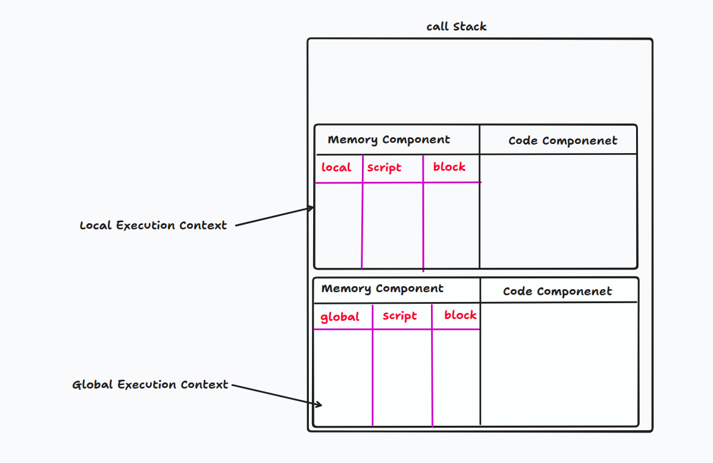
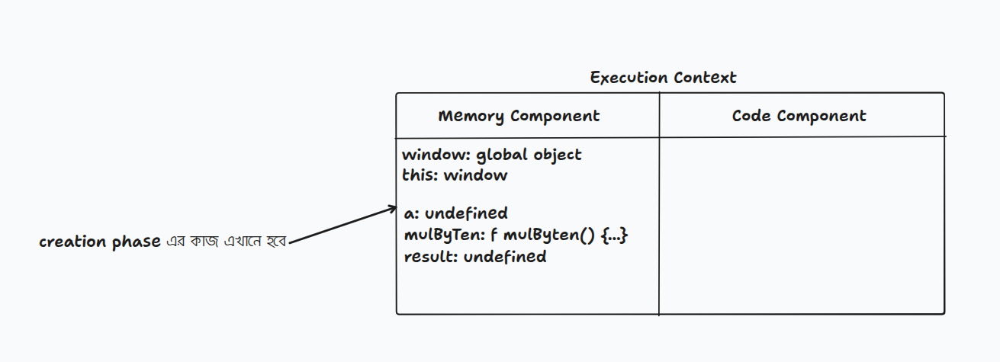
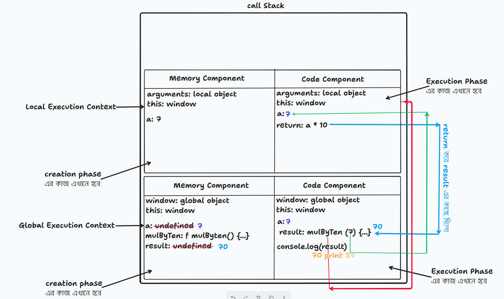
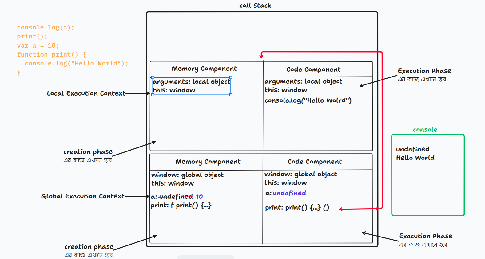
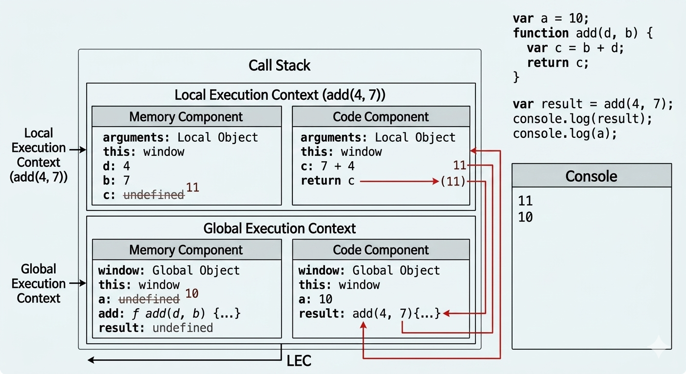

<h1 align="center"> এক্সিকিউশন কনটেক্সট </h1>

এক্সিকিউশন কন্টেক্সট একটি এনভাইরনমেন্ট যেখানে JavaScript কোড execute করা হয়। যখনই JavaScript এ কোনো code run হয়, তখন JavaScript Engine একটি Execution Context তৈরি করে এবং সেই context এর ভিতরে code execute করে। Execution Context মূলত JavaScript Engine এর জন্য একটি working environment যেখানে variable, function এবং code execution পরিচালনা করা হয়।

**Global Execution Context:** JavaScript code run শুরু হওয়ার সাথে সাথেই Global Execution Context (GEC) তৈরি হয় এবং সেটা Call Stack এ push হয়।

---

### Execution Part:

**i. Memory Component or variable environment**

এই অংশে variable এবং function memory তে store হয়।

- Variable এর জন্য memory allocate করা হয়
- Function declaration পুরো function বডি সহ memory তে store হয়।

**_মেমোরি কম্পোনেন্ট মূলত একটিই (Key-Value Pair স্টোরেজ), কিন্তু জাভাস্ক্রিপ্ট ইঞ্জিন ভ্যারিয়েবলের ধরন (var নাকি let/const) এবং তারা কোথায় অবস্থিত তার ওপর ভিত্তি করে মেমোরিকে Global, Script, Local, এবং Block নামক ভিন্ন ভিন্ন স্কোপে বা জোনে ভাগ করে ম্যানেজ করে। যখন কোনো ফাংশন এক্সিকিউট হয়, তখন গ্লোবাল এক্সিকিউশন কন্টেক্সটের ওপর (Call Stack-এ) একটি সম্পূর্ণ নতুন Local Execution Context এসে বসে। এই নতুন লোকাল কন্টেক্সটের নিজস্ব একটা মেমোরি কম্পোনেন্ট থাকে, যার নাম Local Scope।_** <br><br>
 <br><br>
**ii. Code Component (thread of execution)**

এই অংশে JavaScript Engine line by line code execute করে।

- Variable এর value assign করে
- Function call execute করে
- Calculation এবং logic run করে

---

### Execution Phase:

**i. Creation Phase or memory creation phase (এখানে memory create করা হয়।)**

এই phase এ JavaScript Engine পুরো code একবার scan করে এবং memory setup তৈরি করে। যদি কোনো variable পাওয়া যায়, তাহলে Memory Component এ তার জন্য জায়গা তৈরি করা হয় এবং শুরুতে তার value undefined রাখা হয়। কারণ এই পর্যায়ে variable শুধু declare হয়, কিন্তু value assign হয় না। আবার যদি কোনো function declaration পাওয়া যায়, তাহলে পুরো function টিকে memory তে store করা হয়। এই phase এ JavaScript Engine Global Object (window বা global) তৈরি করে এবং this keyword কে সেই global object এর সাথে bind করে। এছাড়াও function এর parameter, scope information এবং lexical environment setup করা হয়। অর্থাৎ Creation Phase এ মূলত Memory Component প্রস্তুত করা হয় এবং সব variable ও function memory তে register করা হয়, যাতে পরবর্তী Execution Phase এ JavaScript Engine সহজে line by line code execute করতে পারে।

```js
let a = 7;

function multByTen(a) {
  return a * 10;
}

let results = multByTen(a);

console.log(results); // 70
```


<br><br><br><br>

**ii. Execution Phase or code execution phase (এখানে প্রতিটা code line by line ধরে ধরে execute করানো হয়।)**

Creation Phase শেষ হওয়ার পর Execution Phase শুরু হয়। এই phase এ JavaScript Engine Code Component ব্যবহার করে line by line code execute করে। Creation Phase এ যেসব variable এর initial value undefined ছিল, Execution Phase এ এসে তাদের actual value assign করা হয়। এছাড়াও function call, calculation, condition checking, loop execution, expression evaluation এবং বিভিন্ন operation এই phase এ সম্পন্ন হয়। যখন কোনো function call হয়, তখন JavaScript Engine সেই function এর জন্য নতুন একটি Function Execution Context তৈরি করে এবং সেটিকে Call Stack (Browser এ থাকে) এ push করে। Function execution শেষ হলে সেই Execution Context আবার stack থেকে pop হয়ে যায়। অর্থাৎ Execution Phase এ JavaScript Engine প্রতিটি code line sequentially execute করে এবং program এর actual behavior সম্পন্ন করে।

```js
let a = 7;

function multByTen(a) {
  return a * 10;
}

let results = multByTen(a);

console.log(results); // 70
```


<br><br>
এখানে execution context তৈরি হওয়ার পর এটা call stack এ push হবে এবং এইটাকে global execution context বলে। call stack প্রথমে empty থাকে। execution phase এ memory component এর value গুলো update হবে, a update হয়ে 7 হবে। পরের line এ function read হবে নাহ কারণ function আগেই memory component এ পুড়া body নিয়ে আছে। result এ আসার পর undefined থেকে function এ update হবে এবং ওই function টা invoked হবে। function invokation এর সাথে সাথে একটা local execution context তৈরি হবে। function এ argumen হিসাবে a এর value 7 পাঠানো হবে এবং function এর parameter সেই argument recevie করবে। local execution context এ a এর মান 7 থাকবে এবং return করবে 7 * 10. এখানে local execution conext এর কাজ শেষ হয়ে যাবে এবং call stack থেকে সেটা pop out হয়ে যাবে। return করা value result এর কাছে আসবে এবং result এর মান update হয়ে 70 হবে এবং পরের লাইনে ওইটা print হবে। এখন global execution context pop out হয়ে যাবে এবং call stack আগের মতো empty হয়ে থাকবে। এভাবে program শেষ হবে।

---

### Hoisting

```js
console.log(a);
print();

var a = 10;

function print() {
  console.log("Hello World");
}
```



**Creation Phase (মেমরি অ্যালোকেশন ধাপ):**

এই ধাপে জাভাস্ক্রিপ্ট ইঞ্জিন কোড রান করার আগেই পুরো ফাইলটি একবার স্ক্যান করে এবং গ্লোবাল মেমরি কম্পোনেন্টে (Memory Component) জায়গা বরাদ্দ করে:

- **ভ্যারিয়েবল ডিক্লেয়ারেশন**: var a দেখার পর মেমরিতে a এর জন্য জায়গা তৈরি হয় এবং প্রাথমিক মান হিসেবে undefined সেট থাকে।

- **ফাংশন ডেফিনিশন**: function print() দেখার পর এর ভেতরের পুরো বডিটি (body) হুবহু মেমরি কম্পোনেন্টে স্টোর বা সেভ হয়ে থাকে।

**Execution Phase (কোড এক্সিকিউশন ধাপ):**

মেমরি সেটআপ শেষ হওয়ার পর ইঞ্জিন কোড কম্পোনেন্টে (Code Component) এসে লাইন বাই লাইন কোড রান করা শুরু করে:

- ১ম লাইন (console.log(a);): মেমরিতে এই মুহূর্তে a এর ভ্যালু undefined থাকায় স্ক্রিনে প্রথমে undefined প্রিন্ট হয়।

- ২য় লাইন (print();): ফাংশনটি কল হওয়ার সাথে সাথে জাভাস্ক্রিপ্ট ইঞ্জিন একটি নতুন Local Execution Context তৈরি করে এবং সেটিকে মেইন Call Stack-এ পুশ (push) করে।
  - লোকাল কনটেক্সটের ক্রিয়েশন ফেজ: যেহেতু print ফাংশনের ভেতরে নতুন কোনো ভ্যারিয়েবল বা ফাংশন ডিক্লেয়ার করা নেই, তাই এই লোকাল কনটেক্সটের মেমরি কম্পোনেন্ট সম্পূর্ণ খালি থাকবে।

  - লোকাল কনটেক্সটের এক্সিকিউশন ফেজ: ইঞ্জিন সরাসরি লাইনটি এক্সিকিউট করে স্ক্রিনে Hello World প্রিন্ট করে দেবে। কাজ শেষ হওয়া মাত্রই এই Local Execution Context-টি স্ট্যাক থেকে পপ (pop) হয়ে রিমুভ হয়ে যাবে।

- ৩য় লাইন (var a = 10;): এবার গ্লোবাল মেমরিতে a এর ভ্যালু undefined থেকে আপডেট হয়ে 10 অ্যাসাইন হবে। অর্থাৎ, প্রথমে undefined প্রিন্ট হয়েছিল, পরে memory কম্পোনেন্টে এসে একচুয়াল ভ্যালু অ্যাসাইন হলো।

- ফাংশন স্কিপ হওয়া: এর নিচে থাকা ফাংশন ডিক্লেয়ারেশনের অংশটুকু এক্সিকিউশন ফেজে ইঞ্জিন আর রিড করবে না, কারণ ক্রিয়েশন ফেজেই এর পুরো বডি মেমরিতে স্টোর করার কাজ সম্পন্ন হয়ে গিয়েছিল।

**যেহেতু Creation Phase-এ মেমরি কম্পোনেন্টে আগেই var এবং function এর জন্য মেমরি অ্যালোকেট করা থাকে, তাই এক্সিকিউশন ফেজে কোডের শুরুতে এদেরকে কল করলেও ইঞ্জিন মেমরি থেকে এদের খুঁজে পায়। এই কারণেই আমরা কোনো এরর (Error) পাই না। ফাংশন বা ভ্যারিয়েবল ডিক্লেয়ার করার আগেই তাদেরকে ব্যবহার করতে পারার এই বিশেষ নিয়ম বা মেকানিজমকেই জাভাস্ক্রিপ্টে Hoisting বলে।**

---

### With Parameter Execution

```js
var a = 10;
function add(d, b) {
  var c = b + d;
  return 11;
}
var result = add(4, 7);
console.log(result);
console.log(a);
```



**Creation Phase**

এই ধাপে জাভাস্ক্রিপ্ট ইঞ্জিন কোড রান করার আগেই পুরো ফাইলটি একবার স্ক্যান করে এবং গ্লোবাল মেমরি কম্পোনেন্টে (Memory Component) জায়গা বরাদ্দ করে:

- var a: মেমরিতে a এর জন্য জায়গা তৈরি হয় এবং প্রাথমিক মান হিসেবে undefined সেট হয়।
- function add(): ইঞ্জিন add ফাংশনটি দেখার পর এর ভেতরের পুরো বডিটি (body) হুবহু মেমরিতে স্টোর করে রাখে।
  -var result: মেমরিতে result এর জন্য জায়গা তৈরি হয় এবং শুরুতে এর মানও undefined থাকে।

**Execution Phase**

মেমরি সেটআপ শেষ হওয়ার পর ইঞ্জিন কোড কম্পোনেন্টে (Code Component) এসে লাইন বাই লাইন কোড রান করা শুরু করে:

- ১ম লাইন (var a = 10;): গ্লোবাল মেমরিতে a এর মান undefined থেকে আপডেট হয়ে 10 অ্যাসাইন হয়।
- ফাংশন স্কিপ হওয়া: এর পরের ফাংশন ডিক্লেয়ারেশনের অংশটুকু (function add...) ইঞ্জিন এক্সিকিউশন ফেজে আর রিড করবে না বা স্কিপ করবে, কারণ ক্রিয়েশন ফেজেই এর মেমরি অ্যালোকেশন হয়ে গেছে।
- ৬ষ্ঠ লাইন (var result = add(4, 7);): এখানে এসে ইঞ্জিন দেখল একটি ফাংশন কল করা হয়েছে—add(4, 7)। ফাংশন কল হওয়ার সাথে সাথে গ্লোবাল এক্সিকিউশন থামিয়ে ইঞ্জিন একটি নতুন Local Execution Context (LEC) তৈরি করে এবং সেটিকে Call Stack-এ পুশ (push) করে। <br>
  **Local Creation Phase**
  - আর্গুমেন্ট ও প্যারামিটার: প্যারামিটার b এবং d লোকাল মেমরিতে রেজিস্টার হয় এবং গ্লোবাল থেকে পাঠানো ভ্যালু অনুযায়ী b = 4 এবং d = 7 হিসেবে অ্যাসাইন হয়ে যায়।
  - ভেতরের ভ্যারিয়েবল (var c): ফাংশনের ভেতরে var c থাকার কারণে লোকাল মেমরিতে c এর জন্য জায়গা তৈরি হয় এবং শুরুতে এর মান undefined থাকে। <br>

  **Local Creation Phase**
  - var c = b + d;: এখানে b (4) এবং d (7) যোগ হয়ে ১১ হয় এবং লোকাল মেমরিতে c এর মান undefined থেকে আপডেট হয়ে 11 হয়।
  - পপ আউট (Pop): রিটার্ন করার সাথে সাথেই এই ফাংশনের কাজ শেষ! তাই এই Local Execution Context-টি Call Stack থেকে পপ (pop) হয়ে চিরতরে ডিলিট হয়ে যায়।

**Comeback to Global Execution Phase**

- var result = add(4, 7); এর বাকি অংশ: ফাংশন থেকে ফেরত আসা 11 মানটি এবার গ্লোবাল মেমরিতে result ভ্যারিয়েবলের মধ্যে অ্যাসাইন হয় (অর্থাৎ result এর মান undefined থেকে 11 হয়)।
- ৭ম লাইন (console.log(result);): স্ক্রিনে প্রিন্ট হবে 11।
- ৮ম লাইন (console.log(a);): গ্লোবাল মেমরি থেকে a এর মান নিয়ে স্ক্রিনে প্রিন্ট হবে 10।

সব কাজ শেষ হয়ে গেলে একদম শেষে মেইন Global Execution Context-টিও Call Stack থেকে পপ (pop) হয়ে পুরো প্রোগ্রামটি শেষ হয়।

---
