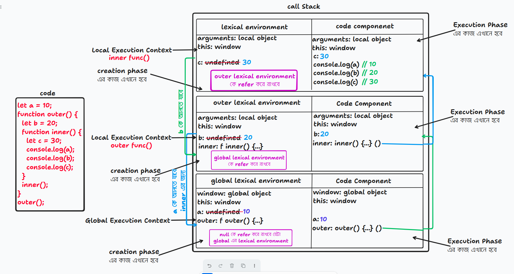

### Scope কি?

Scope মূলত একটা নির্দিষ্ট সীমানাকে বোঝায়, যার বাইরে Variable এবং Function-গুলো অ্যাক্সেসিবল না। যদি এই সীমার বাইরে কোনো Variable এবং Function কে কল করা হয়, তবে সেটির কোনো অস্তিত্ব থাকবে না।
আর এই Scope হচ্ছে দুই প্রকার-

- Global Scope
- Local Scope

**Global Scope**

কোনো ফাংশন বা ব্লকের বাইরে সরাসরি ফাইলে যেসব ভ্যারিয়েবল বা ফাংশন ডিক্লেয়ার করা হয়, কেবল তারাই গ্লোবাল স্কোপের ভেতরে যায় এবং তাদের সব জায়গা থেকে অ্যাক্সেস করা যায়।

```js
var a = 10; // global variable
console.log(a);

function func() {
  // global function
  var b = 20;
  console.log(a); // gobal variable
}

func();
```

**Local Scope**

যখন কোন variable বা function কোন function বা curli bracket {} এর ভিতরে লিখা হয় তখন সেটা local scope এ যায় এবং local scope এর variable বা function শুধুই ওই local scope থেকেই access করা যায়।

```js
{
  let a = 10;
}
function func() {
  var b = 20;
  console.log(b); // can access cause it's under it's own local scope
}

console.log(a); // RefereceError: a is not defined
```

Local Scope আবার দুই প্রকারঃ

1.Function Scope <br> 2. Block Scope

**Function Scope**

যখন কোন function এর ভিতর কোন variable(`var, let, const` ) বা function declare করা হয় তখন সেটা function scope হয়ে যায়। `var` একটা function scope variable, কারণ এইটাকে function scope এর ভিতর declare করলে এটাকে ওই function scope ছাড়া আর কোন জায়গা থেকে access করা যায় নাহ।

```js
function func() {
  var a = 10;
  console.log(a);
  function func2() {
    var b = 20;
    console.log(b);
  }
}
func2(); // ReferenceError: func2 is not defined
console.log(a); // ReferenceError: a is not defined
```

**Block Scope**

যখন কোন curly braces `{}` এর ভিতরে (let, const) দিয়ে কোন variable declare করা হয় তখন সেটা block scope হয়ে যায়। তাকে আর global scope থেকে access করা যায় নাহ। যদি block scope এর ভিতরে var দিয়ে কিছু declare করা হয় তাহলে সেটাকে global scope থেকে access করা যায়।

```js
{
  let a = 10;
  const b = 20;
  console.log(b); // 20
  var c = 20;
}
console.log(c); // 20
console.log(a); // ReferenceError: a is not defined
```

---

### Lexical Environment

Lexical Environment = Memory Component of the current Execution Context + Reference to the parent Lexical Environment

```js
let a = 10;

function outer() {
  let b = 20;

  function inner() {
    let c = 30;

    console.log(a);
    console.log(b);
    console.log(c);
  }

  inner();
}

outer();
```



Global Lexical Environment-এর আউটার রেফারেন্স (Reference to the outer environment) সবসময় null থাকে।" কারণ গ্লোবালের বাইরে আর কোনো প্যারেন্ট স্কোপ বা আউটার এনভায়রনমেন্ট থাকে না। এখানে inner function এর laxical environment হচ্ছে তার নিজের memory component + outer function এর reference , এভাবে নিচের গুলা ও কাজ করতেছে।

### Laxical Scope

আমরা ফাংশনের ভিতরে আমাদের প্রয়োজন অনুযায়ী একাধিক ফাংশন তৈরি করতে পারি এবং চাইল্ড ফাংশনগুলো তার প্যারেন্ট ফাংশনের সব ভেরিয়েবলস এবং আর্গুমেন্টসের এক্সেস পায়। কিন্তু প্যারেন্ট ফাংশনগুলো তার চাইল্ড ফাংশনের ভেরিয়েবলস এবং আর্গুমেন্টসের কোন এক্সেস পায় না। এই যে চাইল্ড ফাংশনগুলো তার প্যারেন্ট ফাংশনের ভেরিয়েবলস এবং আর্গুমেন্টসের এক্সেস পাচ্ছে
এটাকেই বলা হয় Lexical Scoping।

---

### Scope Chain

জাভাস্ক্রিপ্টে কোনো একটা ভ্যারিয়েবলকে খুঁজে পাওয়ার জন্য কারেন্ট (বর্তমান) স্কোপ থেকে শুরু করে একদম গ্লোবাল স্কোপ পর্যন্ত একটার পর একটা লেয়ার বা চেইন ধরে খোঁজার যে প্রক্রিয়া, তাকেই Scope Chain বলে।


এখানে laxical environment ধরে ধরে inner function variable a কে খুজতেছে। inner function যেহেতু outer function এর reference ধরে রেখেছে সে প্রথমে outer function কে বলবে তোমার কাছে কি a নামের variable আছে কি নাহ, যখন বলবে নাই তখন সে outer function এর কাছে global lexical enviorenment এর reference থাকে ওই refernece ধরে global এর কাছ থেকে সে a variable কে access করতে পারে। এই যে একটা scope থেকে অন্য scope এ খুঁজে খুঁজে variable এর scope খুঁজাটাই scope chain.

---

### Closure

Closure হচ্ছে ফাংশনের এমন একটা বৈশিষ্ট্য
যে বৈশিষ্ট্যের কারণে ফাংশন এক্সিকিউশন শেষ হয়ে যাবার পরেও তার lexical envirenment এ অবস্থিত সকল variable
কে মনে রাখতে পারে।

```js
function outer() {
  var a = 10;
  function inner() {
    console.log(a);
  }
  return inner;
}

var log = outer();
log();
```

উপরের code এ global execution context এর memory component এ log এর value undefined হবে creation phase এ, এবং log() function পুরোটা বসে যাবে। execution phase এ log এর value undefined থেকে outer() function হয়ে call হবে এবং নতুন local execution context এ outer() function এর ভিতর থাকা a এর মান undefined থাকবে এবং execution phase এ inner কে return করে দেওয়া হবে। এখানে inner function এর সাথে outer function এর `a` variable bind হয়ে return করবে। এবার log এর ভিতর inner function বসে যাবে এবং log() call হবে। যেহেতু inner function এর ভিতর outer function এর variable `a` use করা হচ্ছে তাই এই a থাকবে closure এর ভিতর, closure এই a কে মনে রাখবে কারণ outer function call stack থেকে pop  হয়ে যাওয়ার পর inner এর ভিতর `a` variable কে খুঁজে পাওয়া যাবে নাহ, কিন্তু inner function কে `a` use করতে হবে। তাই যখন use করবে তখন এই `a` এর মান আসবে closure থেকে। এভাবেই closure কাজ করে। 