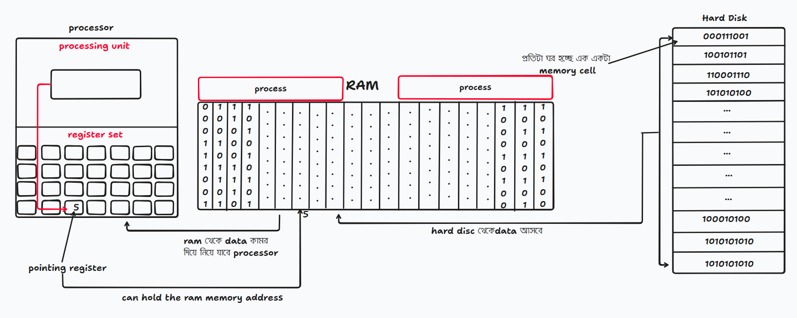
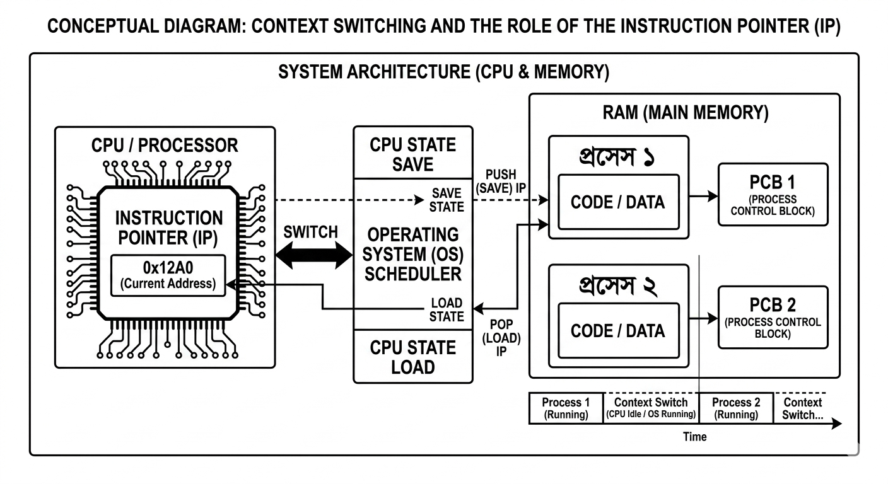
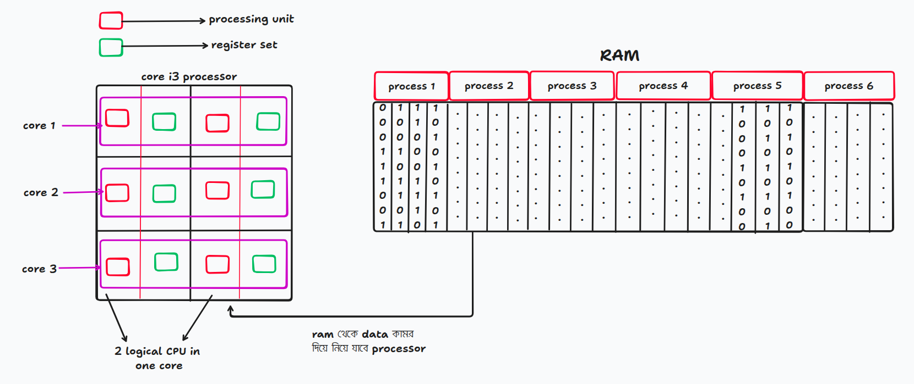
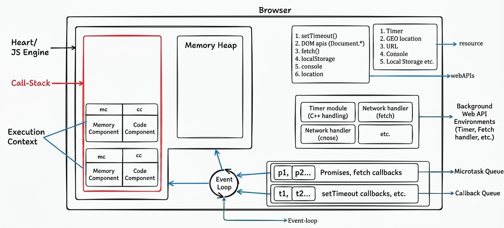

<h1 align="center">operating System with JS</h1>

### ফাইল সেভ থেকে প্রসেসরের রান হওয়া: সম্পূর্ণ লাইফসাইকেল

১. **ফাইল সেভ হওয়া (Hard Disk):** যখন আমরা কোনো ফাইল সেভ করি, তখন সেটি স্থায়ীভাবে Hard Disk বা SSD-তে গিয়ে জমা হয়। হার্ডডিস্কে এই ফাইলগুলো সম্পূর্ণ বাইনারি (`0` এবং `1`) আকারে সংরক্ষিত থাকে। হার্ডডিস্কের ভেতরের ফিজিক্যাল মেমোরি সেলগুলোতে এই ডেটাগুলো মূলত বড় বড় গুচ্ছ বা **Memory Block/Sector** (সাধারণত 512 Bytes বা 4KB) হিসেবে জমা থাকে।

২. **ফাইল রান হওয়া (RAM):** যখন আমরা কোনো ফাইল বা কোড রান করি, তখন সেটি হার্ডডিস্ক থেকে কম্পিউটারের মেইন মেমোরি বা **RAM (Random Access Memory)**-এ চলে আসে। RAM-এর প্রতিটা সিঙ্গেল সেলের সাইজ সবসময় ফিক্সড—**৮-বিট বা ১ বাইট**। যেহেতু র‍্যামে কোনো মেকানিক্যাল ঘূর্ণায়মান পার্টস থাকে না, তাই RAM হার্ডডিস্কের তুলনায় অনেক বেশি ফাস্ট বা দ্রুতগতির হয়।

৩. **প্রসেসিং ফেজ (Processor):** RAM-এ ডেটা আসার পর প্রসেসর সেই ডেটা নিয়ে কাজ শুরু করে। প্রসেসরের মূলত দুটি প্রধান অংশ থাকে:

- **Processing Unit (ALU - Arithmetic Logic Unit):** যা সব ধরনের গাণিতিক ও লজিক্যাল হিসাব-নিকাশ করে।
- **Register Set:** এটি প্রসেসরের নিজস্ব সুপার-ফাস্ট মেমোরি।

৪. **৩২-বিট বনাম ৬৪-বিট কম্পিউটার:**
RAM থেকে কোড বা ডেটাগুলো প্রসেসরের **Register Set**-এর রেজিস্টারগুলোতে এসে জমা হয়।

- এই রেজিস্টারগুলো যদি এক টানে সর্বোচ্চ **৩২টি বিট (32-bit)** ডেটা একসাথে ধরে রেখে কাজ করতে পারে, তবে সেই কম্পিউটারকে **32-bit computer** বলে।
- আর রেজিস্টারগুলো যদি একবারে সর্বোচ্চ **৬৪টি বিট (64-bit)** ডেটা একসাথে নিয়ে কাজ করতে পারে, তবে তাকে **64-bit computer** বলে।

Register set এর ভিতর pointing register থাকে তার কাজ হল RAM এর address কে point করে রাখা। আমরা যখন যেই file run করবো তখন RAM এর ওই cell কে pointing register point করে রাখবে। পয়েন্টার রেজিস্টার প্রসেসরকে যেদিকে আঙুল দিয়ে নির্দেশ করে, প্রসেসর সেই দিকে দৌঁড়ায় আর কাজ করে।



---

### Multi program run

যখন আমরা এক সাথে অনেক গুলা program run করি তখন একটা নতুন জিনিসের আবির্ভাব হয় তার নাম হচ্ছে process. এই জায়গায় ও pointing register একটা address কে point করে রাখবে কিন্তু যখন run হবে তখন point এর সাথে সাথে একটা process ও তৈরি হবে। একটা process আরেকটা process থেকে আলাদা। তাই একসাথে একাধিক program চালাইতে পারি আমরা।

### Context Switching

কম্পিউটারে যখন আমরা একসাথে একাধিক প্রসেস (vartual computer) রান করি, তখন প্রসেসরের ভেতরে থাকা একমাত্র মেইন Pointing Register বা Instruction Pointer (IP) এক অভিনব উপায়ে পুরো বিষয়টিকে সামাল দেয়। আসলে একটি নির্দিষ্ট মুহূর্তে প্রসেসর কেবল একটিমাত্র প্রসেসের নির্দিষ্ট অ্যাড্রেসকেই পয়েন্ট করতে পারে। কিন্তু মাল্টিটাস্কিংয়ের এই ম্যাজিকটি সম্ভব হয় অপারেটিং সিস্টেম ও প্রসেসরের যৌথ কারিশমা, অর্থাৎ Context Switching-এর মাধ্যমে। যখনই অনেকগুলো প্রসেস একসাথে চলতে চায়, অপারেটিং সিস্টেম মেমোরিতে প্রতিটি প্রসেসের জন্য আলাদা একটি ডায়েরি বা Process Control Block (PCB) তৈরি করে রাখে। প্রসেসর যখন চোখের পলকে (কয়েক মিলিমেকেন্ডের ব্যবধানে) এক প্রসেস থেকে অন্য প্রসেসে লাফ দেয়, তখন সে register set এর সব তথ্য তার নিজস্ব PCB-তে সুরক্ষিতভাবে লিখে রেখে আসে। এরপর নতুন প্রসেসের PCB থেকে তার আগের অ্যাড্রেসটি টেনে এনে নিজের মেইন Pointing Register-এ বসিয়ে সেখান থেকে এক্সিকিউশন শুরু করে। মেমোরির এই অতি দ্রুত অদল-বদল এবং পয়েন্টার রেজিস্টারের অনবরত ঠিকানা পরিবর্তনের কারণেই মূলত সিস্টেমে Concurrency (কনকারেন্সি) বা একই সময়সীমায় একাধিক কাজ সামলানোর পরিবেশ তৈরি হয়; যার ফলে বাস্তবে কাজগুলো একের পর এক চললেও আমাদের চোখ ও মস্তিষ্কের কাছে মনে হয় ব্যাকগ্রাউন্ডে সবগুলো প্রসেস একদম সমান্তরালে বা একসাথে সচল রয়েছে।



---

### Core i3

Core i3 মানে ৩টা ঘর, একটা single core-এ ২টা করে logical cpu থাকে, একটাতে processing unit আর একটাতে থাকে register set। তাহলে ৩টা core-এ ৬টা logical cpu থাকে, তার মানে ৬টা register set থাকবে এবং ৬টা processing unit থাকবে। যদি এখন ৬টা process হয়, তাহলে ৬টা processor ৬টা কাজকে at a time করতে পারবে, যার ফলে কোনো context switching হবে না। এইটা হচ্ছে parallel programming অথবা multi-programming অথবা multi tasking। যদি process ৬ এর বেশি হয়, তখন context switching হবে। তখন context switching আর parallel programming এক সাথে হবে।



---

### Multi-thread (for single core)

**Thread (থ্রেড):** এটি হলো এক্সিকিউশন (Execution)-এর ক্ষুদ্রতম ইউনিট। একটি প্রসেসের ভেতরেই থ্রেড অবস্থান করে। একে ওএসের "Lightweight Process" বা হালকা ওজনের প্রসেসও বলা হয়।

যখন আমরা কোনো অ্যাপ বা ব্রাউজার চালাই, তখন ব্যাকগ্রাউন্ডে লাইন বাই লাইন কোড এক্সিকিউট হতে থাকে। এই সময় অ্যাপের ভেতরে একই সাথে দুটি আলাদা কাজের সৃষ্টি হতে পারে—যেমন একটি পার্ট স্ক্রিনে লোডিং অ্যানিমেশন দেখায় এবং আরেকটি পার্ট থার্ড-পার্টি এপিআই (API) থেকে ডেটা ফেচ করে নিয়ে আসে। যেহেতু একটি সিঙ্গেল-কোর প্রসেসর বাস্তবে একই মুহূর্তে (At a time) দুটি কাজ করতে পারে না, তাই এই সমস্যা সমাধানের জন্য প্রসেসের ভেতরে আলাদা আলাদা থ্রেড (Thread) তৈরি হয়। তখন একটি থ্রেড লোডিংয়ের কাজ সামলায় এবং আরেকটি থ্রেড ডেটা ফেচের কাজ সামলায়। যেহেতু কোর মাত্র একটি, তাই প্রসেসর ওই একটি কোরের ভেতরেই চোখের পলকে এই দুই থ্রেডের মধ্যে অনবরত কন্টেক্সট সুইচিং (Context Switching) বা অদল-বদল করতে থাকে। মেমোরি ও প্রসেসরের অতি দ্রুত এই অদল-বদলের কারণেই আমাদের কাছে মনে হয় অ্যাপে লোডিং এবং ডেটা ফেচিংয়ের কাজ দুটি একসাথে বা সমান্তরালে চলছে; আর সিঙ্গেল-কোর প্রসেসরের ভেতরে ঘটা এই পুরো চমৎকার মেকানিজমটিকেই মূলত মাল্টি-থ্রেডিং (Multi-threading) বলে। **জাভা (Java), পাইথন (Python), সি# (C#)-এর মতো মাল্টি-থ্রেডেড ল্যাঙ্গুয়েজগুলো (Multi-threading languages) মূলত ব্যাকগ্রাউন্ডে এভাবেই একাধিক থ্রেড তৈরি ও ম্যানেজ করার কাজটি করে থাকে।**

---

### JS Multi-thread না হয়েও কিভাবে thread গুলা manage করে

JavaScript একটি single threaded language. JavaScript যখন run হয় তখন একটা execution context run হয়। একবারে উপরের টা সবার আগে run হবে।

Browser হচ্ছে javascript কে execute করার জন্য responsible. JavaScript execute করে JavaScript engine. Browser এর মধ্যে js engine থাকে। JS engine এর ভিতরে থাকে call stack. Call-Stack এর ভিতরে থাকে execution context. Browser এর নিজস্ব কিছু resource আছে যেমনঃ Timer, Geo location, Url, Console, Local storage etc. এই সব resource এর সাথে কথা বলার জন্য browser এর কাছে থাকে web apis যেমনঃ setTimeOut(), Dom apis (Document.\*), fetch(), localStorage, console, location etc. 

---

```js
console.log("start");


setTimeout(function print1(){ // setTimeout is first class function and print is callback function
    console.log("Yesss1");
}, 5000); // ekta function, ekta time

setTimeout(function print2(){ // setTimeout is first class function and print is callback function
    console.log("Yesss2");
}, 4000); // ekta function, ekta time

console.log("End");
```

১. জাভাস্ক্রিপ্ট যখন মাল্টি-থ্রেডের (Multi-thread) মতো একসাথে অনেক কাজ করতে যায়, তখন সে একা পারে না, তাকে Browser এর সাহায্য নিতে হয়।

২. উপরের কোডে setTimeout দুইটার সময় আলাদা। জাভাস্ক্রিপ্ট ইঞ্জিন যখনই কোড রান করতে করতে setTimeout এর মুখোমুখি হবে, সে নিজে এর জন্য অপেক্ষা করবে না। সে টাইমারের দায়িত্বটা ব্রাউজারের নিজস্ব Web API (Timer Module) এর কাছে হ্যান্ডওভার (পাঠিয়ে) করে দিবে।

৩. ব্রাউজার ব্যাকগ্রাউন্ডে ওই দুইটা টাইমার নিয়ে কাউন্টডাউন করতে থাকবে। এই ফাঁকে জাভাস্ক্রিপ্ট ইঞ্জিন এক মুহূর্তও সময় নষ্ট না করে পরের লাইনে চলে যাবে। যার কারণে টাইমার শেষ হওয়ার আগেই কনসোলে start এবং End আগে এক্সিকিউট (প্রিন্ট) হয়ে যাবে।

৪. ব্যাকগ্রাউন্ডে ব্রাউজারের টাইমারের নির্ধারিত সময় যখনই শেষ হবে, ব্রাউজার ওই কলব্যাক ফাংশনগুলোকে ইঞ্জিনের বাইরে থাকা Callback Queue (বা Task Queue) এর মধ্যে পাঠিয়ে দিবে। (যেহেতু ৪ সেকেন্ডের টাইমার আগে শেষ হবে, তাই ব্রাউজার print2 কে আগে এবং ৫ সেকেন্ড শেষ হলে print1 কে পরে কিউতে পাঠাবে)।

৫. এরপর কাজ শুরু হবে Event Loop এর। ইভেন্ট লুপ সারাক্ষণ পাহারা দিয়ে দেখে যে জাভাস্ক্রিপ্ট ইঞ্জিনের ভেতরের Call Stack একদম ফাঁকা আছে কি নেই (অর্থাৎ গ্লোবাল এক্সিকিউশন কন্টেক্সটসহ সব কাজ শেষ হয়েছে কিনা)।

৬. যখনই কল স্ট্যাক পুরোপুরি ফাঁকা হয়ে যাবে, ইভেন্ট লুপ তখন Callback Queue থেকে সিরিয়াল অনুযায়ী একটা একটা করে কাজ (প্রথমে print2, তারপর print1) কল স্ট্যাকে এনে রাখবে এবং জাভাস্ক্রিপ্ট ইঞ্জিন সেগুলোকে ফাইনালি এক্সিকিউট করতে থাকবে। যার কারণে আউটপুটে Yesss2 আগে এবং Yesss1 পরে দেখাবে।



---