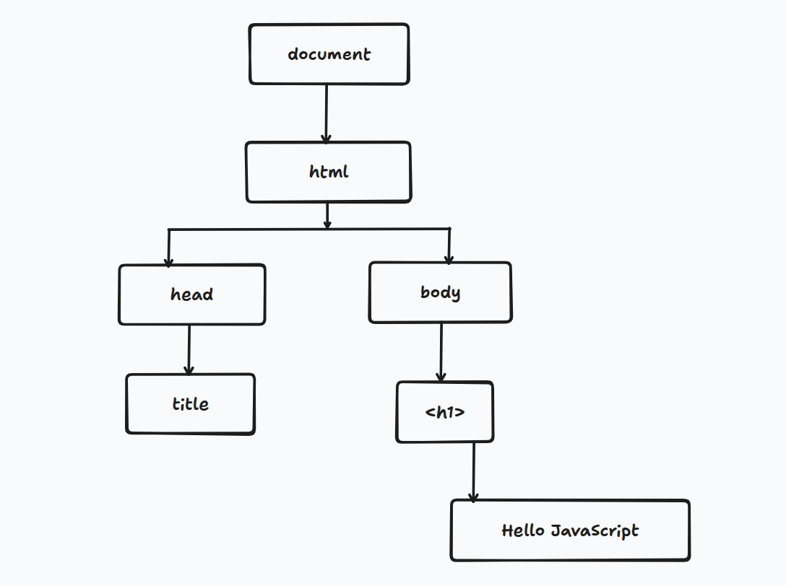

**DOM (Document Object Model)** হলো HTML ডকুমেন্টের একটি **Object Model**। যখন একটি HTML ফাইল ওয়েব ব্রাউজার লোড করে, তখন ব্রাউজার HTML কোডকে পার্স করে একটি DOM Tree তৈরি করে। এই DOM Tree-তে HTML ডকুমেন্টের প্রতিটি element, attribute এবং text-কে Node হিসেবে উপস্থাপন করা হয়। DOM-এর গাছের (Tree) মতো কাঠামোর কারণে JavaScript সহজেই HTML element খুঁজে বের করতে, পরিবর্তন করতে, নতুন element যোগ করতে বা মুছে ফেলতে পারে।

```js
<!doctype html>
<html>
    <head>
        <title>DOM</title>
    </head>
    <body>
        <h1>Hello JavaScript</h1>
    </bpdy>
</hmtl>
```



**DOM API (Application Programming Interface)** হলো কিছু Method এবং Property-এর সমষ্টি, যা JavaScript-কে HTML ডকুমেন্টের যেকোনো Element-এর Content (বিষয়বস্তু), Structure (কাঠামো) এবং Style (নকশা/রূপ) পরিবর্তন করার সুবিধা দেয়।

### finding html element

| Method                     | কাজ                                                   |
| -------------------------- | ----------------------------------------------------- |
| `getElementById()`         | id দিয়ে element খোঁজে                                 |
| `getElementsByClassName()` | class দিয়ে element খোঁজে                              |
| `getElementsByTagName()`   | tag name দিয়ে element খোঁজে                           |
| `querySelector()`          | CSS selector ব্যবহার করে প্রথম matching element খোঁজে |
| `querySelectorAll()`       | CSS selector ব্যবহার করে সব matching element খোঁজে    |

- `id` দিয়ে element খোঁজার পর যদি পাওয়া যায় তাহলে object আকারে return করবে। না পেলে null রাখবে।
-  `tag` দিয়ে খুঁজলে সব element কে খুঁজে বের করে ওই spacific tag এর
- `class name` দিয়ে যখন element খুঁজা হয় তখন একই নামের সব class element কে ধরতে পারে।
- `querySelectorAll()` দিয়ে যখন element খুঁজে বের করবো তখন এটা একটা node list দিবে, তখন কাজ করতে গেলে array এর মতো করে ধরে ধরে কাজ করতে হবে। 
